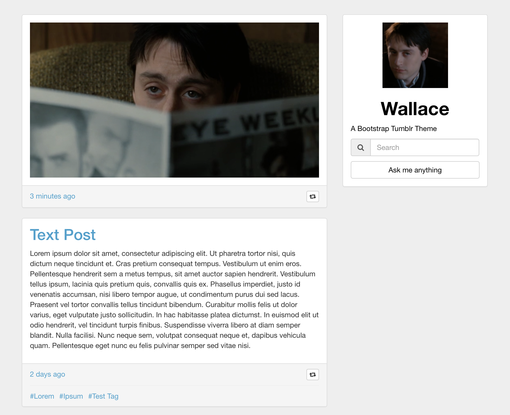

# Wallace, A Bootstrap Tumblr Theme



## tl;dr

Take the index.html file in the /dist folder and upload it to the “Edit Theme” section of Tumblr. That’s it. You’re done.

## The Hard Way

Wallace provides two methods for styling the theme. Option 1 is the simple method described above. You fetch the Bootstrap.min.css file from a CDN, and the theme’s header contains the few Tumblr specific stylings required to make the page render correctly.

Option 2 is a bit more tricky. Due to the popularity of Bootstrap, sites powered by the framework have all started to look the same. To combat this, Bootstrap offers several different methods of theming the framework. The most simplistic method uses [getbootstrap.com/customize/](http://getbootstrap.com/customize/), while the slightly more advanced methods rely on the LESS and Sass CSS preprocessors. CSS Preprocessors act as a superset of CSS, allowing you to take advantage of more advanced features such as variables, inheritance, and mixins.

Wallace is designed to take advantage of [Sass](http://sass-lang.com). It uses [NodeJS’s](https://nodejs.org/) [LibSass](https://github.com/sass/libsass) to compile Sass files, aided by the [Grunt](http://gruntjs.com) task runner and the [Bower](http://bower.io) package manager. If you’d like to theme Wallace, you’ll need a system with Node, Grunt, and Bower installed. Node’s [website](https://nodejs.org) has everything you need to install the scripting language. Once that’s done, you’ll want to install Grunt and Bower globally on your development system.

```
npm install grunt-cli -g
npm install bower -g
```

Now that you’v gotten that taken care of, you can let Wallace’s install script’s do it’s thing. Execute the NPM package.json file, then Bower’s bower.son file.

```
npm install
bower install
```

Finally, all you need to do is run the Gruntfile.js. Grunt will take the ./sass/styles.scss file and compile it down into the ./css/styles.css file.

`grunt`

styles.*scss* already has a @import command for the \_bootstrap.scss file that Bower fetched. styles.*css* is the only stylesheet your Tumblr theme will need. Go to the “Edit Appearance” section of Tumblr, then click “Edit Theme”. Click “Edit HTML”, then copy and paste Wallace’s Index.html file into the window. Click the gear in the top left corner and then click “Theme Assets”. Upload your compiled style.css file here. Find the section on line 164 that reads “[REPLACE WITH TUMBLR UPLOADED CSS FILE]”. Highlight this text, then slick the “Insert” link next to the styles.css file you uploaded. Click “Update Preview”, and then “Save” at the top of the coding pane. Wallace should now be successfully applied to your Tumblr blog.
